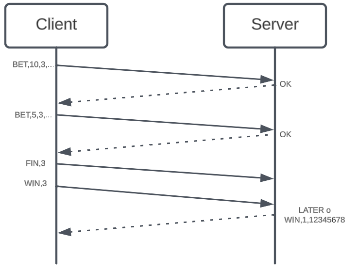
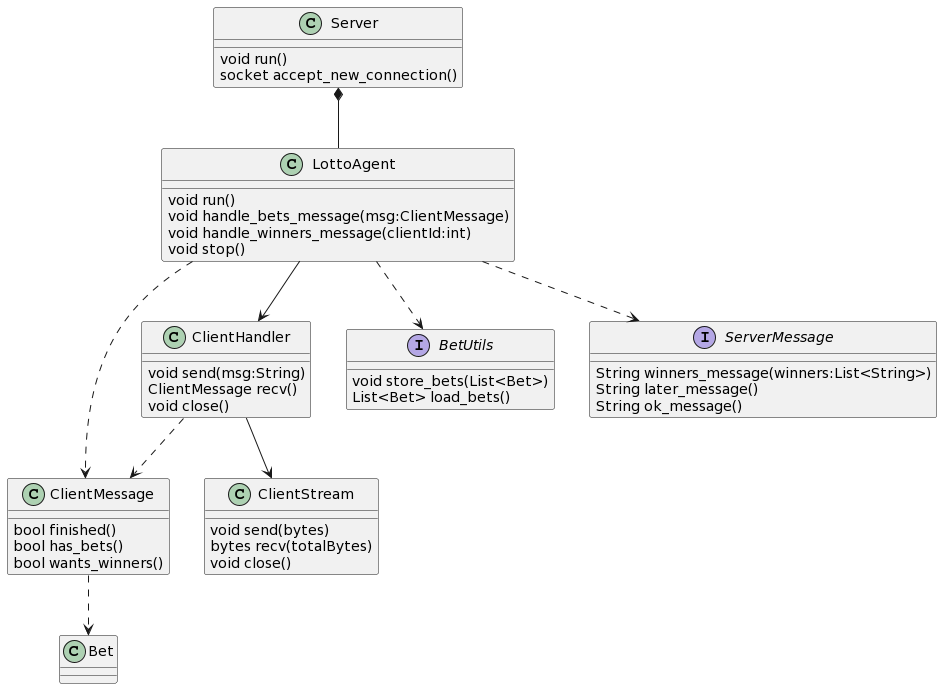
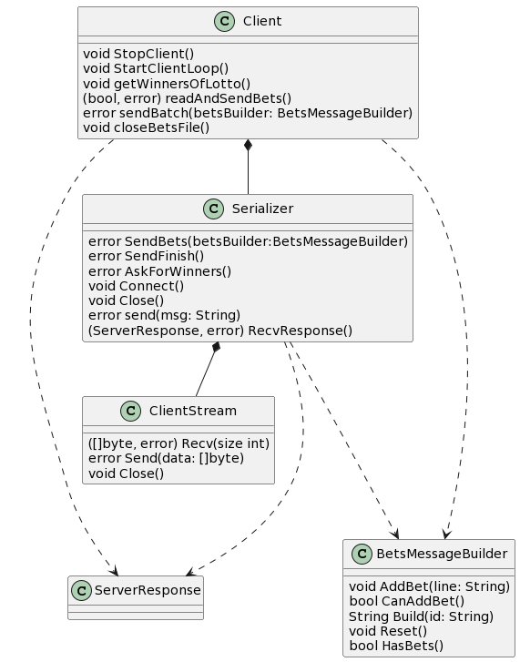

# TP0: Docker + Comunicaciones + Concurrencia

En el presente repositorio se provee un ejemplo de cliente-servidor el cual corre en containers con la ayuda de [docker-compose](https://docs.docker.com/compose/). El mismo es un ejemplo práctico brindado por la cátedra para que los alumnos tengan un esqueleto básico de cómo armar un proyecto de cero en donde todas las dependencias del mismo se encuentren encapsuladas en containers. El cliente (Golang) y el servidor (Python) fueron desarrollados en diferentes lenguajes simplemente para mostrar cómo dos lenguajes de programación pueden convivir en el mismo proyecto con la ayuda de containers.

Por otro lado, se presenta una guía de ejercicios que los alumnos deberán resolver teniendo en cuenta las consideraciones generales descriptas al pie de este archivo.

## Instrucciones de uso
El repositorio cuenta con un **Makefile** que posee encapsulado diferentes comandos utilizados recurrentemente en el proyecto en forma de targets. Los targets se ejecutan mediante la invocación de:

* **make \<target\>**:
Los target imprescindibles para iniciar y detener el sistema son **docker-compose-up** y **docker-compose-down**, siendo los restantes targets de utilidad para el proceso de _debugging_ y _troubleshooting_.

Los targets disponibles son:
* **docker-compose-up**: Inicializa el ambiente de desarrollo (buildear docker images del servidor y cliente, inicializar la red a utilizar por docker, etc.) y arranca los containers de las aplicaciones que componen el proyecto.
* **docker-compose-down**: Realiza un `docker-compose stop` para detener los containers asociados al compose y luego realiza un `docker-compose down` para destruir todos los recursos asociados al proyecto que fueron inicializados. Se recomienda ejecutar este comando al finalizar cada ejecución para evitar que el disco de la máquina host se llene.
* **docker-compose-logs**: Permite ver los logs actuales del proyecto. Acompañar con `grep` para lograr ver mensajes de una aplicación específica dentro del compose.
* **docker-image**: Buildea las imágenes a ser utilizadas tanto en el servidor como en el cliente. Este target es utilizado por **docker-compose-up**, por lo cual se lo puede utilizar para testear nuevos cambios en las imágenes antes de arrancar el proyecto.
* **build**: Compila la aplicación cliente para ejecución en el _host_ en lugar de en docker. La compilación de esta forma es mucho más rápida pero requiere tener el entorno de Golang instalado en la máquina _host_.

### Servidor
El servidor del presente ejemplo es un EchoServer: los mensajes recibidos por el cliente son devueltos inmediatamente. El servidor actual funciona de la siguiente forma:
1. Servidor acepta una nueva conexión.
2. Servidor recibe mensaje del cliente y procede a responder el mismo.
3. Servidor desconecta al cliente.
4. Servidor procede a recibir una conexión nuevamente.

### Cliente
El cliente del presente ejemplo se conecta reiteradas veces al servidor y envía mensajes de la siguiente forma.
1. Cliente se conecta al servidor.
2. Cliente genera mensaje incremental.
recibe mensaje del cliente y procede a responder el mismo.
3. Cliente envía mensaje al servidor y espera mensaje de respuesta.
Servidor desconecta al cliente.
4. Cliente vuelve al paso 2.

Al ejecutar el comando `make docker-compose-up` para comenzar la ejecución del ejemplo y luego el comando `make docker-compose-logs`, se observan los siguientes logs:

```
$ make docker-compose-logs
docker compose -f docker-compose-dev.yaml logs -f
client1  | time="2023-03-17 04:36:59" level=info msg="action: config | result: success | client_id: 1 | server_address: server:12345 | loop_lapse: 20s | loop_period: 5s | log_level: DEBUG"
client1  | time="2023-03-17 04:36:59" level=info msg="action: receive_message | result: success | client_id: 1 | msg: [CLIENT 1] Message N°1\n"
server   | 2023-03-17 04:36:59 DEBUG    action: config | result: success | port: 12345 | listen_backlog: 5 | logging_level: DEBUG
server   | 2023-03-17 04:36:59 INFO     action: accept_connections | result: in_progress
server   | 2023-03-17 04:36:59 INFO     action: accept_connections | result: success | ip: 172.25.125.3
server   | 2023-03-17 04:36:59 INFO     action: receive_message | result: success | ip: 172.25.125.3 | msg: [CLIENT 1] Message N°1
server   | 2023-03-17 04:36:59 INFO     action: accept_connections | result: in_progress
server   | 2023-03-17 04:37:04 INFO     action: accept_connections | result: success | ip: 172.25.125.3
server   | 2023-03-17 04:37:04 INFO     action: receive_message | result: success | ip: 172.25.125.3 | msg: [CLIENT 1] Message N°2
server   | 2023-03-17 04:37:04 INFO     action: accept_connections | result: in_progress
client1  | time="2023-03-17 04:37:04" level=info msg="action: receive_message | result: success | client_id: 1 | msg: [CLIENT 1] Message N°2\n"
server   | 2023-03-17 04:37:09 INFO     action: accept_connections | result: success | ip: 172.25.125.3
server   | 2023-03-17 04:37:09 INFO     action: receive_message | result: success | ip: 172.25.125.3 | msg: [CLIENT 1] Message N°3
server   | 2023-03-17 04:37:09 INFO     action: accept_connections | result: in_progress
client1  | time="2023-03-17 04:37:09" level=info msg="action: receive_message | result: success | client_id: 1 | msg: [CLIENT 1] Message N°3\n"
server   | 2023-03-17 04:37:14 INFO     action: accept_connections | result: success | ip: 172.25.125.3
server   | 2023-03-17 04:37:14 INFO     action: receive_message | result: success | ip: 172.25.125.3 | msg: [CLIENT 1] Message N°4
client1  | time="2023-03-17 04:37:14" level=info msg="action: receive_message | result: success | client_id: 1 | msg: [CLIENT 1] Message N°4\n"
server   | 2023-03-17 04:37:14 INFO     action: accept_connections | result: in_progress
client1  | time="2023-03-17 04:37:19" level=info msg="action: timeout_detected | result: success | client_id: 1"
client1  | time="2023-03-17 04:37:19" level=info msg="action: loop_finished | result: success | client_id: 1"
client1 exited with code 0
```

## Parte 1: Introducción a Docker
En esta primera parte del trabajo práctico se plantean una serie de ejercicios que sirven para introducir las herramientas básicas de Docker que se utilizarán a lo largo de la materia. El entendimiento de las mismas será crucial para el desarrollo de los próximos TPs.

### Ejercicio N°1:
Modificar la definición del DockerCompose para agregar un nuevo cliente al proyecto.

#### Resolución
La resolución de este ejercicio consiste en agregar al docker compose:

```yaml
  client2:
    container_name: client2
    image: client:latest
    entrypoint: /client
    environment:
      - CLI_ID=2
      - CLI_LOG_LEVEL=DEBUG
    networks:
      - testing_net
    depends_on:
      - server
```
Se puede ejecutar con `make docker-compose-up`

* Commit `Ex 1: Add new client` [6340f765ba29f5fe0d24ff1623e8f460a7182b68](https://github.com/brunograssano/Distribuidos-TP0/commit/6340f765ba29f5fe0d24ff1623e8f460a7182b68)

### Ejercicio N°1.1:
Definir un script (en el lenguaje deseado) que permita crear una definición de DockerCompose con una cantidad configurable de clientes.

#### Resolución
Para resolver este ejercicio se definió el script `create_compose_with_multiple_clients.py` que utiliza la biblioteca Jinja. Este script sigue la siguiente lógica:
1. Pregunta la cantidad de clientes que se quieren
2. Carga el template de `templates/docker-compose-clients.yaml`. Este template hace que se vayan agregando los clientes
3. Escribe el resultado en la carpeta `clients-docker-compose` indicando en el nombre la cantidad de clientes del compose. Por ejemplo `docker-compose-4-clients.yaml` tiene 4 clientes

Para ejecutarlo:
```
$ python3 create_compose_with_multiple_clients.py
```

Ejemplo de ejecución
```
$ python3 create_compose_with_multiple_clients.py
How many clients? 7
Wrote docker compose with 7 clients to clients-docker-compose/docker-compose-7-clients.yaml
```

Para usar los compose generados:
* Se puede reemplazar el archivo `docker-compose-dev.yaml` y usar `make docker-compose-up`
* Se puede ejecutar `docker compose -f docker-compose-{cantidad de clientes}-clients.yaml up -d --build` moviendolo a la base del repositorio. (para que encuentre los archivos de configuración en caso de tener los cambios del ejercicio 2)


* Commit `Ex 1.1: multiple clients` [91b1839212089cf9bcc04062f693953d99cc646c](https://github.com/brunograssano/Distribuidos-TP0/commit/91b1839212089cf9bcc04062f693953d99cc646c)


### Ejercicio N°2:
Modificar el cliente y el servidor para lograr que realizar cambios en el archivo de configuración no requiera un nuevo build de las imágenes de Docker para que los mismos sean efectivos. La configuración a través del archivo correspondiente (`config.ini` y `config.yaml`, dependiendo de la aplicación) debe ser inyectada en el container y persistida afuera de la imagen (hint: `docker volumes`).

#### Resolución

Para resolver este ejercicio se mapean los archivos de configuración dentro de `volumes` en el docker compose y se sacan estos archivos de las imágenes.
- En el server se utiliza el `.dockerignore`
- En el cliente se saca el `COPY`

Se puede ejecutar con `make docker-compose-up`. Notar que al cambiar las configuraciones se hace build con el cache y no de cero.

* Commit `Ex2 move config to volume` [8f068ae06e472054f9e2a11d537d02fb8b59bea0](https://github.com/brunograssano/Distribuidos-TP0/commit/8f068ae06e472054f9e2a11d537d02fb8b59bea0) 
* Fix del `.dockerignore` [e5d5c18d1c6040c0ab3aefa6580940430efe96b2](https://github.com/brunograssano/Distribuidos-TP0/commit/e5d5c18d1c6040c0ab3aefa6580940430efe96b2)

### Ejercicio N°3:
Crear un script que permita verificar el correcto funcionamiento del servidor utilizando el comando `netcat` para interactuar con el mismo. Dado que el servidor es un EchoServer, se debe enviar un mensaje al servidor y esperar recibir el mismo mensaje enviado. Netcat no debe ser instalado en la máquina _host_ y no se puede exponer puertos del servidor para realizar la comunicación (hint: `docker network`).

#### Resolución

Para resolver este ejercicio:
* Se crea el script `netcat/run_netcat.sh` que envía un mensaje al servidor y compara el resultado. Dependiendo de este imprime un mensaje. Para funcionar el script requiere de las variables de entorno `$SERVER` y `$PORT`. 
* Se hace el Dockerfile para tener instalado `netcat` y el script `netcat/Dockerfile`
* Se agrega en el docker compose el servicio para ejecutar el script. Lo importante es que se utilice la misma red que el servidor y que se le pasen las variables de entorno. 

Se puede ejecutar con `make docker-compose-up`

* Commit `Ex3: test server with netcat` [8f068ae06e472054f9e2a11d537d02fb8b59bea0](https://github.com/brunograssano/Distribuidos-TP0/commit/10a2c0e79ffdb62db0cec2875adb3b822ec2bdad)

### Ejercicio N°4:
Modificar servidor y cliente para que ambos sistemas terminen de forma _graceful_ al recibir la signal SIGTERM. Terminar la aplicación de forma _graceful_ implica que todos los _file descriptors_ (entre los que se encuentran archivos, sockets, threads y procesos) deben cerrarse correctamente antes que el thread de la aplicación principal muera. Loguear mensajes en el cierre de cada recurso (hint: Verificar que hace el flag `-t` utilizado en el comando `docker compose down`).

#### Resolución

Para resolver el ejercicio se agregan los handlers en ambas aplicaciones.
* En el servidor se lanza una excepcionque es atrapada y cierra los recursos
* En el cliente se lanza una `goroutine` que escucha por la señal. Al recibirla, cierra el socket, liberando al cliente en caso de estar escuchando, y le envía un mensaje para que termine su loop de ejecución.

Se puede ejecutar con `make docker-compose-up` y probar el cierre con `docker compose -f docker-compose-dev.yaml stop -t 3`

* Commit `Ex4 handle SIGTERM in server & client` [668ae4e4046bf9b06b495ab4f5cdbb4be5d174ac](https://github.com/brunograssano/Distribuidos-TP0/commit/668ae4e4046bf9b06b495ab4f5cdbb4be5d174ac)

## Parte 2: Repaso de Comunicaciones

Las secciones de repaso del trabajo práctico plantean un caso de uso denominado **Lotería Nacional**. Para la resolución de las mismas deberá utilizarse como base al código fuente provisto en la primera parte, con las modificaciones agregadas en el ejercicio 4.

### Ejercicio N°5:
Modificar la lógica de negocio tanto de los clientes como del servidor para nuestro nuevo caso de uso.

#### Cliente
Emulará a una _agencia de quiniela_ que participa del proyecto. Existen 5 agencias. Deberán recibir como variables de entorno los campos que representan la apuesta de una persona: nombre, apellido, DNI, nacimiento, numero apostado (en adelante 'número'). Ej.: `NOMBRE=Santiago Lionel`, `APELLIDO=Lorca`, `DOCUMENTO=30904465`, `NACIMIENTO=1999-03-17` y `NUMERO=7574` respectivamente.

Los campos deben enviarse al servidor para dejar registro de la apuesta. Al recibir la confirmación del servidor se debe imprimir por log: `action: apuesta_enviada | result: success | dni: ${DNI} | numero: ${NUMERO}`.

#### Servidor
Emulará a la _central de Lotería Nacional_. Deberá recibir los campos de la cada apuesta desde los clientes y almacenar la información mediante la función `store_bet(...)` para control futuro de ganadores. La función `store_bet(...)` es provista por la cátedra y no podrá ser modificada por el alumno.
Al persistir se debe imprimir por log: `action: apuesta_almacenada | result: success | dni: ${DNI} | numero: ${NUMERO}`.

#### Comunicación:
Se deberá implementar un módulo de comunicación entre el cliente y el servidor donde se maneje el envío y la recepción de los paquetes, el cual se espera que contemple:
* Definición de un protocolo para el envío de los mensajes.
* Serialización de los datos.
* Correcta separación de responsabilidades entre modelo de dominio y capa de comunicación.
* Correcto empleo de sockets, incluyendo manejo de errores y evitando los fenómenos conocidos como [_short read y short write_](https://cs61.seas.harvard.edu/site/2018/FileDescriptors/).

#### Resolución
Debido a que este y los próximos ejercicios tratan sobre la misma base del módulo de comunicación, el desarrollo de esta parte se fue haciendo teniendo en cuenta que se iba a requerir que sea genérico. Más adelante se va a encontrar la sección en donde se analiza en detalle el protocolo implementado. 

En este ejercicio hay que tener en cuenta que para la ejecución son necesarias las variables de entorno: `CLI_NAME`, `CLI_SURNAME`,`CLI_DOCUMENT`, `CLI_BIRTHDATE` y `CLI_NUMBER`. Estas son pasadas a través del docker compose.

Se puede ejecutar con `make docker-compose-up`

* Commit `Ex5 lotto business logic and coms` [9cf34cfbdf0645bb2d249904ca8031149fc4366b](https://github.com/brunograssano/Distribuidos-TP0/commit/9cf34cfbdf0645bb2d249904ca8031149fc4366b)

### Ejercicio N°6:
Modificar los clientes para que envíen varias apuestas a la vez (modalidad conocida como procesamiento por _chunks_ o _batchs_). La información de cada agencia será simulada por la ingesta de su archivo numerado correspondiente, provisto por la cátedra dentro de `.data/datasets.zip`.
Los _batchs_ permiten que el cliente registre varias apuestas en una misma consulta, acortando tiempos de transmisión y procesamiento. La cantidad de apuestas dentro de cada _batch_ debe ser configurable. Realizar una implementación genérica, pero elegir un valor por defecto de modo tal que los paquetes no excedan los 8kB. El servidor, por otro lado, deberá responder con éxito solamente si todas las apuestas del _batch_ fueron procesadas correctamente.

#### Resolución

Cuestiones a tener en cuenta:
* Se eliminan las variables de entorno `CLI_NAME`, `CLI_SURNAME`,`CLI_DOCUMENT`, `CLI_BIRTHDATE` y `CLI_NUMBER` ya que no son necesarias al leer del archivo.
* Se agrega la variable de entorno `CLI_BETS_BATCH_SIZE`. Por defecto, toma de valor 100 si no se completa para tener paquetes inferiores a 8kB. En el ejercicio se completa por el docker compose.
* Se agrega la variable de entorno `CLI_BETS_FILE` para indicar de que archivo se leen las apuestas. Este archivo lo agrego a través de un volumen, por ejemplo `./.data/agency-3.csv:/agency-3.csv`
* **Para ejecutar el ejercicio es necesario extraer los archivos** de `.data/datasets.zip` en `.data` .

Se puede ejecutar con `make docker-compose-up`

* Commit `Ex6 handle bets in batch request` [ed91cd3482b0537785cf31a21f6647b45cf4352f](https://github.com/brunograssano/Distribuidos-TP0/commit/ed91cd3482b0537785cf31a21f6647b45cf4352f) 
* Commit `Ref create bets message builder` [ce08f33f04be03ddf198e22f273103b770943eb7](https://github.com/brunograssano/Distribuidos-TP0/commit/ce08f33f04be03ddf198e22f273103b770943eb7)


### Ejercicio N°7:
Modificar los clientes para que notifiquen al servidor al finalizar con el envío de todas las apuestas y así proceder con el sorteo.
Inmediatamente después de la notificacion, los clientes consultarán la lista de ganadores del sorteo correspondientes a su agencia.
Una vez el cliente obtenga los resultados, deberá imprimir por log: `action: consulta_ganadores | result: success | cant_ganadores: ${CANT}`.

El servidor deberá esperar la notificación de las 5 agencias para considerar que se realizó el sorteo e imprimir por log: `action: sorteo | result: success`.
Luego de este evento, podrá verificar cada apuesta con las funciones `load_bets(...)` y `has_won(...)` y retornar los DNI de los ganadores de la agencia en cuestión. Antes del sorteo, no podrá responder consultas por la lista de ganadores.
Las funciones `load_bets(...)` y `has_won(...)` son provistas por la cátedra y no podrán ser modificadas por el alumno.

#### Resolución

En este ejercicio se expande la lógica del caso de uso agregando más mensajes

Se puede ejecutar con `make docker-compose-up`

* Commit `Ex7 Ask for lotto winners` [9943ad978bec75ef181dc9b7f60574833df34f22](https://github.com/brunograssano/Distribuidos-TP0/commit/9943ad978bec75ef181dc9b7f60574833df34f22)
* Commit `Ref create bets message builder` [ce08f33f04be03ddf198e22f273103b770943eb7](https://github.com/brunograssano/Distribuidos-TP0/commit/ce08f33f04be03ddf198e22f273103b770943eb7)

### Protocolo de comunicación

La comunicación entre el cliente y el servidor se realiza partiendo de que se envía primero un mensaje que contiene la cantidad de bytes a enviar, y después el mensaje con los datos.
* El mensaje con la cantidad de bytes a enviar es un entero de 4 bytes encodeado en formato big endian
* El mensaje con los datos a armar se va componiendo de un string que es encodeado a bytes con formato `utf-8`. Este string se va armando con un formato estilo `csv` donde los campos se van separando por comas y se identifica el tipo de mensaje de acuerdo al identificador de la primera parte (Por ejemplo `ID,DATO1,DATO2`).

Los mensajes que se manejan del cliente al servidor son:
* `BET,Cantidad de apuestas,ID de la agencia,Cantidad de apuestas * [Nombre,Apellido,Documento,Nacimiento,Numero]` para el envío de las apuestas. Por ejemplo, `BET,2,5,Federico Nahuel,Mancuso,30206889,1997-07-27,5009,Kevin Alejandro,Sorbera,35863340,1997-09-20,1074` (A partir del ej 5 en adelante)
* `FIN,ID de la agencia` para indicar al servidor que ya no se van a enviar más apuestas. Por ejemplo `FIN,5` (A partir del ej 6 en adelante)
* `WIN,ID de la agencia` para preguntar al servidor por los ganadores de su agencia. Por ejemplo `WIN,5` (A partir del ej 7 en adelante)

Del servidor al cliente:
* `OK` para indicar que una operación del cliente se realizó exitosamente
* `LATER` para indicar que el cliente debe esperar para obtener los resultados. Si recibe este mensaje se optó por cerrar la conexión debido a que el cliente va a entrar en un exponential backoff. Cuando termine de esperar vuelve a conectarse y preguntar (A partir del ej 7 en adelante)
* `WIN,Cantidad de ganadores,Cantidad de ganadores * [Documento de ganador]` para enviarle al cliente los ganadores de su agencia. Por ejemplo `WIN,3,24807259,24807259,24807259` (A partir del ej 7 en adelante)

En la siguiente imagen podemos ver un ejemplo de como transcurre la comunicación entre las dos partes


* Primero se envían las apuestas y se va respondiendo con OK.
* El cliente al finalizar avisa al servidor y envía un mensaje pidiendo los ganadores
* El servidor puede responder con los ganadores o decirle al servidor que intente más tarde si faltan loterías que procesar.

### Modelo

El servidor tiene el siguiente modelo para separar las responsabilidades:

* `Server` tiene la responsabilidad de atender las nuevas conexiones. A partir del ejercicio 8 a cada conexión le crea un nuevo hilo que será joineado cuando se reciba otra conexión si es que termino su ejecución para liberar sus recursos
* `LottoAgent` es el responsable del manejo de la lógica del negocio. Dependiendo del mensaje recibido, realiza una acción.
* `ClientHandler` hace la serialización y deserialización de los mensajes siguiendo el protocolo ya explicado.
* `ClientStream` es un wrapper del socket. Implementa `recv` y `send` para prevenir short reads/writes. 
* `BetUtils` son las funciones provistas para el guardado y lectura de apuestas en el archivo.
* `ClientMessage` es el mensaje recibido del cliente una vez decodeado.
* `Bet` es la clase de apuestas provista.
* `ServerMessage` es una factory de mensajes que el servidor puede enviar.


En el caso del cliente:

* `Client` maneja la lógica del negocio.
* `Serializer` serializa y deserializa los mensajes.
* `ClientStream` es un wrapper del socket. Implementa `recv` y `send` para prevenir short reads/writes. 
* `ServerResponse` representa a la respuesta del servidor deserializada.
* `BetsMessageBuilder` es un builder para la realización del mensaje de apuestas.


## Parte 3: Repaso de Concurrencia

### Ejercicio N°8:
Modificar el servidor para que permita aceptar conexiones y procesar mensajes en paralelo.
En este ejercicio es importante considerar los mecanismos de sincronización a utilizar para el correcto funcionamiento de la persistencia.

En caso de que el alumno implemente el servidor Python utilizando _multithreading_,  deberán tenerse en cuenta las [limitaciones propias del lenguaje](https://wiki.python.org/moin/GlobalInterpreterLock).

#### Resolución

Para que el servidor permita aceptar conexiones y procesar mensajes en paralelo, se optó por utilizar threads que manejen los clientes a medida que se van conectando. 
* El hilo se crea y pone a ejecutar cada vez que se recibe una nueva conexión. 
* Se aprovecha para hacerle join a los hilos terminados cuando se recibe una nueva conexión.

Dado que en el caso de uso hay puntos comunes que involucran a todos los clientes, es necesario agregar algunos mecanismos de sincronización:
* El acceso a las funciones de `load_bets` y `store_bets` es protegido con un lock debido a que la implementación provista no es thread-safe. De esta forma nos aseguramos que el acceso al archivo va a estar sincronizado
* Para saber cuando terminaron todos los clientes se utilizó una lista que indica que loterías finalizaron. Esta lista se protege con un lock

*Nota: Se decidió realizar el ejercicio con threads y no con procesos debido a que mayoritariamente el servidor está haciendo operaciones de I/O por lo que el GIL no se vuelve un cuello de botella.*

Se puede ejecutar con `make docker-compose-up`

* Commit `Ex8 handle clients concurrently` [ee607fa77b2fa47ea2c26576ef2faf0e4464d2cf](https://github.com/brunograssano/Distribuidos-TP0/commit/ee607fa77b2fa47ea2c26576ef2faf0e4464d2cf)

## Consideraciones Generales
Se espera que los alumnos realicen un _fork_ del presente repositorio para el desarrollo de los ejercicios.
El _fork_ deberá contar con una sección de README que indique como ejecutar cada ejercicio.
La Parte 2 requiere una sección donde se explique el protocolo de comunicación implementado.
La Parte 3 requiere una sección que expliquen los mecanismos de sincronización utilizados.

Finalmente, se pide a los alumnos leer atentamente y **tener en cuenta** los criterios de corrección provistos [en el campus](https://campusgrado.fi.uba.ar/mod/page/view.php?id=73393).
